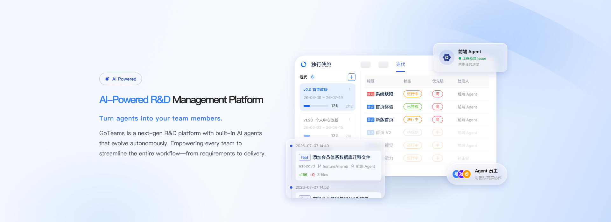
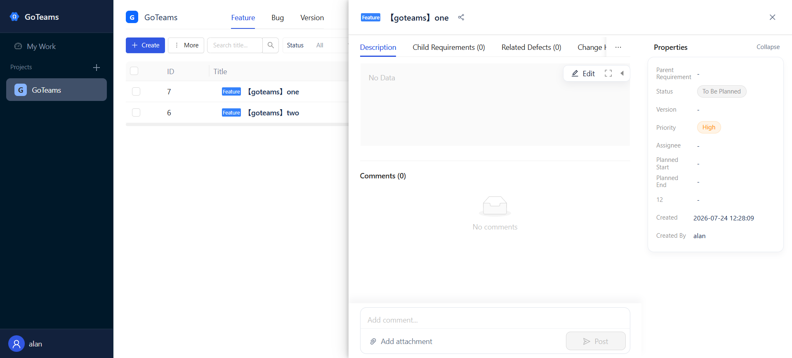
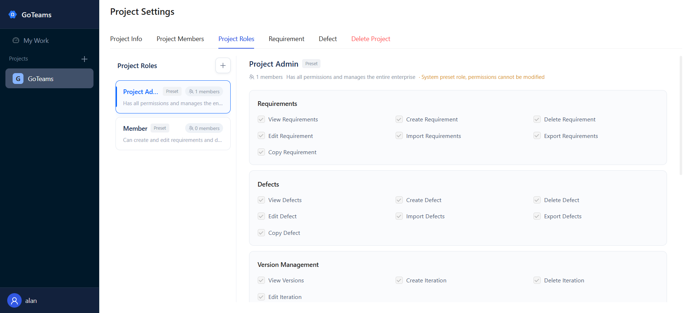
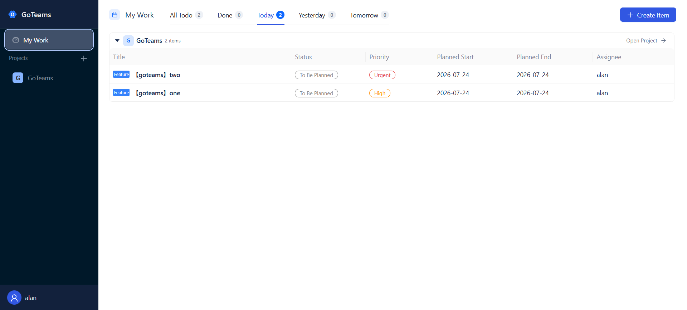
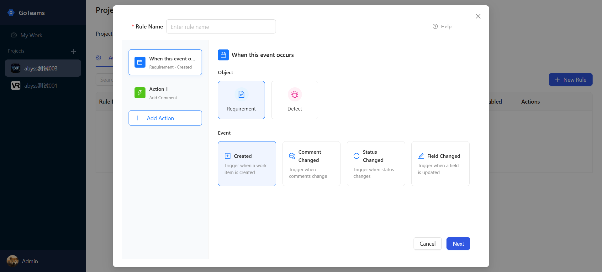

<p align="center"><a href="http://goteams.ai/"></a></p>

<p align="center">
  <a href="./README.md">English</a> |
  <a href="./README_zh.md">简体中文</a> |
  <a href="./UpdateLog.md">UpdateLog</a>
</p>

## 🎯 Product Positioning

GoTeams is a next-generation AI R&D collaboration platform that makes AI agents your team members. With deeply integrated AI agent capabilities, built-in Agent employees, and support for Agent self-evolution, GoTeams enables every team to seamlessly manage the entire lifecycle from requirements to delivery.

## ✨ Core Features

### 🤖 AI Agent Collaboration

- **Agent Employees**: Agents appear in the assignment dropdown menu — assign tasks to an Agent just like you would to a colleague.

- **Autonomous Execution**: Agents proactively pick up work and drive it forward independently, with a complete execution lifecycle: queued, claimed, started, completed, or failed.

- **Proactive Reporting & Notifications**: Agents proactively notify when blocked, with real-time push updates for progress tracking.

- **Unified Activity Timeline**: All actions by humans and Agents are visible on a unified timeline for seamless collaboration.

### 📋 Work Item Management

- **Flexible Work Item Types**: Support for requirements and defects with customizable fields and workflows.

- **Kanban & List Views**: Drag-and-drop Kanban management and list views with flexible switching.

- **Iteration Management**: Create and manage iterations, associate work items, and track iteration progress.

- **Batch Operations**: Batch update status, priority, assignee, and iteration, plus batch export and delete.

### ⚙️ Automation

- **Automation Rule Engine**: Let repetitive collaboration workflows execute automatically with the automation rule engine, freeing up team productivity.

- **Condition-Triggered Actions**: Configure conditional branches and actions that automatically trigger when conditions are met.

### 🏢 Team & Permission Management

- **Multi-Level Permissions**: Support for workspace admins, members, and custom roles with fine-grained functional and data permission controls.

- **Data Visibility Scopes**: Three visibility configurations — all members, partial members, or self only.

- **Role-Based Access Control**: Preset and custom roles with per-module functional permissions and independent data access controls.

### 🛠️ Skill Library

- **Reusable Skill Definitions**: Save solutions as standardized skills, packaging code, configuration, and context together.

- **Team-Wide Sharing**: Write once, usable by every Agent on the team. The skill library grows continuously over time.

- **Compound Growth**: Skills multiply and strengthen with use, forming lasting team knowledge assets.

## 🛸 UI

- 🌍 **Free Trial**: [goteams.ai](http://goteams.ai/)
- 🧪 **Test Project**: This free trial environment is a test project for evaluation purposes.
- 🖼️ **Screenshots**:

<p align="center">       </p>
<p align="center">       </p>

## 🏢 Commercial Edition Installation & Operations Guide (goteamsctl)

This guide is intended for delivery and operations personnel. It covers the complete set of commands for extracting, installing, upgrading, rolling back, managing services, viewing logs, and uninstalling the two Commercial Edition packages (standard and offline). All operations are performed with the bundled control tool `goteamsctl`. The target environment is **Linux amd64**.

---

### 1. Two Types of Installation Packages

The Commercial Edition is delivered as self-extracting `.run` files. Depending on whether Docker images must be fetched over the network, there are two **separate packages**, built and distributed independently:

| Package | File Name | Size | Network Requirement | Use Case |
|---------|-----------|------|---------------------|----------|
| **Standard (online)** | `goteams-commercial-cn-<version>.run` | Medium (Docker runtime included, images excluded) | Must reach the image registry during install/upgrade for online `docker compose pull` | Servers with internet access |
| **Offline** | `goteams-commercial-cn-<version>-offline.run` | Large (Docker runtime + all images included) | **No external network needed at all**; install/upgrade runs `docker load` directly on the bundled `payload/images/images.tar.gz` | Intranet, air-gapped, or no-egress environments |

Latest version **v0.0.30** download links:

- Standard (online): https://github.com/zhimaAi/goteams-license/releases/download/v0.0.30/goteams-commercial-cn-v0.0.30.run
- Offline: https://github.com/zhimaAi/goteams-license/releases/download/v0.0.30/goteams-commercial-cn-v0.0.30-offline.run

> The install, upgrade, and uninstall commands are **identical for both packages** — when the installer detects `payload/images/images.tar.gz`, it performs an offline `docker load` and skips image pulling.
>
> Both packages **bundle offline installers for Docker Engine and Docker Compose** (`payload/runtime/`, ~150 MB), which noticeably increases the package size compared with older packages without the runtime. Bare-metal hosts without Docker can therefore be deployed out of the box (see Section 2). The runtime files live only inside the package and are **never** written to the system during extraction or upgrade.

#### 1.1 Package Directory Structure After Extraction

```
goteams-commercial-cn-<version>[-offline]/
├── goteamsctl                  # Control tool (install/upgrade/service/logs/uninstall)
├── manifest.json               # Version and file manifest
└── payload/
    ├── bin/goteams             # Backend binary
    ├── docker/                 # docker-compose.yml, nginx, startup scripts
    ├── web/dist.tar.gz         # Frontend build artifacts
    ├── runtime/                # Bundled offline Docker installers (both packages)
    │   ├── docker-<ver>.tgz    #   Docker Engine static package (8 binaries)
    │   ├── docker-compose      #   Compose V2 CLI plugin
    │   └── systemd/            #   containerd.service, docker.service, docker.socket
    └── images/images.tar.gz    # Offline package only: all Docker images
```

### 2. Environment Requirements

| Item | Requirement |
|------|-------------|
| OS | Linux amd64 (a real Linux server or VM; **WSL and other environments that do not expose `/sys/class/dmi` are not supported**, as the device code depends on hardware identifiers) |
| Docker | If Docker is installed and working (`docker compose version` succeeds), installation skips the bundled runtime. On bare-metal hosts without Docker, `install` automatically installs `payload/runtime/` from the package, which additionally requires **root**, **systemd (PID 1)**, and **iptables or nft** (the static package does not ship firewall user-space tools) |
| Disk | ≥ 10 GB free on the installation partition |
| Memory | ≥ 2 GB total |
| Network | **Standard package**: must reach the image registry to pull images during install/upgrade. **Offline package**: no external network needed at all. Online license activation/renewal requires outbound access to the vendor's licensing service; with an offline license key, no external network is needed whatsoever |
| Port | The website listens on `8080` by default; can be changed during installation |

### 3. Installation and Usage

Choose **either** the standard package or the offline package according to the customer environment, upload the `.run` file to the server, and execute the following in order:

```bash
sudo chmod +x ./goteams-commercial-cn-v0.0.20-offline.run
./goteams-commercial-cn-v0.0.20-offline.run
cd goteams-commercial-cn-v0.0.20-offline
sudo ./goteamsctl install   # Install
```

The installer performs the following steps:

1. **Pre-checks**: platform (linux/amd64), package integrity (SHA256SUMS + manifest whitelist), disk space (≥10 GB), memory (≥2 GB), hardware identifiers (`/sys/class/dmi`).
2. **Docker runtime preparation**: if a working Docker Engine + Compose V2 is already present on the host, it prints `bundled runtime install skipped` and skips; otherwise it installs the bundled runtime.
3. **Interactive prompts** (press Enter to accept the default):
    - `timezone`: time zone, default `Asia/Shanghai`
    - `web port (site)`: site port, default `8080` (port occupancy is detected automatically and re-prompted)
    - `proceed with installation`: enter `y` to confirm and start
4. **Completion output**: site URL, default administrator `admin` (initial password built into the corresponding environment package, with a forced password change on first login), and license status.

#### 3.1 Other Commands

```bash
sudo ./goteamsctl status                 # Show container status, installed version, and license status (JSON from /api/system/license/status)
sudo ./goteamsctl upgrade                # Then proceed with the upgrade after the package is downloaded; the service is briefly interrupted and data is preserved
sudo ./goteamsctl start                  # Start in order: postgres/redis → goteams (with migrations) → web
sudo ./goteamsctl stop                   # Stop all services (data volumes preserved)
sudo ./goteamsctl restart                # stop + start
sudo ./goteamsctl version                # goteamsctl's own version (edition/commit)
sudo ./goteamsctl reset-admin-password   # Confirm with y when prompted, then immediately save the printed new password
sudo ./goteamsctl logs                   # All services, follow mode, last 200 lines
sudo ./goteamsctl logs goteams           # Backend application logs only
sudo ./goteamsctl logs web               # nginx/frontend only
sudo ./goteamsctl logs postgres          # Database only
sudo ./goteamsctl logs redis             # Cache only
sudo ./goteamsctl uninstall              # Uninstall (irreversible): permanently deletes all containers, networks, data volumes (postgres/redis data), and the entire installation root directory
```

### 4. Data Backup and Restore

The tool backs up automatically before upgrades; you can also back up manually:

```bash
# Manual backup (same approach used internally by upgrade)
sudo docker compose --project-name goteams-commercial \
  --env-file /opt/goteams/config/.env \
  -f /opt/goteams/current/docker/docker-compose.yml \
  exec -T postgres pg_dump -U goteams goteams > /backup/manual_$(date +%Y%m%d).sql
```

Restore the database (run only after the target database is confirmed empty or safe to overwrite):

```bash
sudo docker compose --project-name goteams-commercial \
  --env-file /opt/goteams/config/.env \
  -f /opt/goteams/current/docker/docker-compose.yml \
  exec -T postgres psql -U goteams goteams < /backup/manual_20260909.sql
```

### 5. FAQ

| Symptom | Cause and Resolution |
|---------|----------------------|
| `already looks installed; use upgrade instead` | `state.json` already exists in the target directory — this is an upgrade scenario; use `goteamsctl upgrade` instead |
| `docker engine is not reachable` | Docker is installed but the daemon is not running: `systemctl start docker` (the installer will not start an existing Docker daemon for you) |
| `docker compose v2 is required` | The host has the engine but is missing the plugin; `install` fixes this automatically, or run `sudo ./goteamsctl install-docker` manually |
| `the bundled Docker runtime is installed through systemd, but this host has no running systemd` | PID 1 on the host is not systemd (containers, some minimal/customized systems); prepare Docker yourself before installing |
| `Docker needs iptables or nft on the host` | The static engine does not include firewall user-space tools: run `yum install -y iptables` or `apt-get install -y iptables`, then retry |
| `a Docker installation was detected but is not usable` | Half-installed state (CLI or unit present but the engine is unusable); by fail-closed design, the tool refuses to make changes. Troubleshoot the existing Docker instance following the printed commands, then re-run |
| `refusing to overwrite existing ...` | A binary or unit with the same name already exists at the target location; the tool does not overwrite system files — confirm who owns Docker on this machine first |
| `bundled docker runtime failed to start` | The engine is installed but fails to start: check the cause with `journalctl -u docker -u containerd --no-pager -n 80` |
| `insufficient disk space / memory` | Free up disk space or add memory, then retry (requires ≥10 GB / ≥2 GB) |
| `port 8080 is already in use` | Choose a different port in interactive installation; in `--yes` mode, free the default port first |
| `WSL and other non-native Linux environments are not supported` | The host does not expose `/sys/class/dmi`, so a device code cannot be generated; switch to a real Linux server/VM |
| `images: docker exited with code N` during install/upgrade | The intranet cannot reach the image registry to pull images: use the **offline package**, or allow network access to the registry |
| Upgrade reports `upgrade requires a version greater than ...` | The package version is not newer than the installed version; make sure you downloaded a newer package |
| Upgrade reports `can only upgrade from vX.Y.Z or later` | The installed version is lower than the new package's `min_upgrade_version`. Packages v0.0.23 and earlier wrote "the build number of the previous packaging" into this field, allowing upgrades only from the immediately preceding version: rebuild with the fixed packaging script (default floor `v0.0.1`) to enable direct upgrades; if there really is a cross-version incompatibility, tighten it explicitly with `-MinUpgradeVersion` |
| Features unavailable after license expiration | By fail-closed design: only login, identity/permission, version info, and owner renewal endpoints remain available; the frontend is fixed to the `/members?tab=version` page to complete renewal |
| License invalidated after a device code change | Migrating the VM or changing hardware changes the device code; restore the original hardware configuration or contact the vendor to reissue the license |

## 💻 Tech Stack

---

- **Backend**: Go + Gin

- **Frontend**: Vue 3 + Ant Design Vue + Vite

- **Database**: PostgreSQL 16 + Redis

## 🏡 Community & Contact Us

---

Feel free to contact us for help or to provide suggestions to improve GoTeams. You can reach us through:

- **Email**: Send an email to [jarvis@2bai.com.cn](mailto:jarvis@2bai.com.cn) to contact us.

## 📖 Changelog

---

See [UpdateLog.md](./UpdateLog.md).

## License

---

This project is licensed under the AGPL 3.0 License. See the [LICENSE](./LICENSE) file for the full license text.
